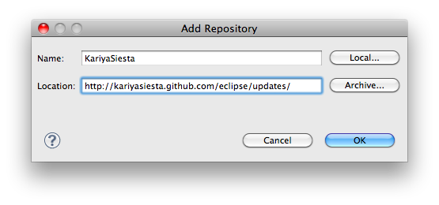

インストール方法
=======================
Windows OS をお使いの場合
-----------------------

KariyaSiesta の動作には以下のソフトウェアが必要です。

- JRE_ 5 or later
- Eclipse_ 3.5 or later
- Sapid_ 6.9 or lator
- Cygwin_ 1.7 or lator

Cygwin は、devel カテゴリのアプリケーションをすべてインストールしてください。
また、Windows の環境変数 PATH に Cygwin の bin ディレクトリを追加してください。

それ以外の OS をお使いの場合
-----------------------

- JRE_ 5 or later
- Eclipse_ 3.5 or later
- Sapid_ 6.9 or lator

.. _JRE: http://www.java.com/
.. _Eclipse: http://www.eclipse.org/
.. _Sapid: http://www.sapid.org/FTP-BIN-CURRENT/
.. _Cygwin: http://www.cygwin.com/

**Help** -> **Install New Software** をクリックします。
**Add...** をクリックします。

表示されたダイアログに以下の情報を入力します。

**Name:**
  **KariyaSiesta**
**Location:**
  **http://kariyasiesta.github.com/eclipse/updates/**

**KariyaSiesta** をチェックして、 **Next** をクリックします。

.. image:: _static/install02.png
   :width: 500

途中、証明書関係の確認ダイアログが表示された場合には、 **OK** をクリックしてください。

Eclipse の再起動を促すメッセージが表示されますので、
**Restart Now** をクリックしてください。

以上で、KariyaSiesta のインストールは完了です。

インストール後の設定
-----------------------

インストール後に以下の設定が必要です。
本設定はワークスペース毎に設定が必要です。

**Preferences** をクリックし、 **KariyaSiesta** をクリックします。
**SAPID_DEST** に **[Sapid をインストールしたディレクトリ]** を入力してください。

