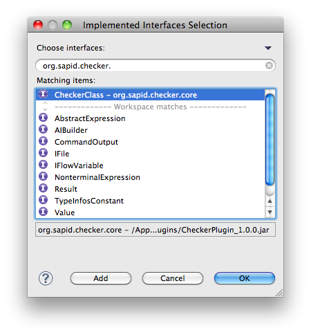
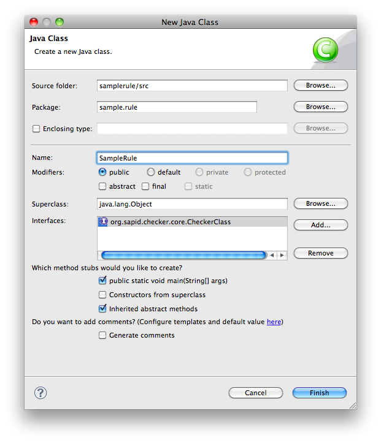

ルールの作成方法
=======================
KariyaSiesta は 3種類のルール作成法を提供しています。

- `XPath によるルール記述 <#id2>`_
- `Java によるルール記述 <#id3>`_
- `JavaScript によるルール記述 <#id4>`_

XPath > JavaScript > Java の順でルールの記述は難しくなりますが、
その分表現力は高くなります。
作成したいルールの複雑度に応じて、お選びください。
以下では、それぞれのルール記述方法について説明します。

XPath によるルール記述
-----------------------
XPath を用いたルール記述方法については チュートリアル_
で詳しく説明していますので、そちらをご参照ください。

Java によるルール記述
-----------------------
Java を用いたルール記述方法について説明します。

Java を用いたルールは、以下のインタフェースを実装します。

 org.sapid.checker.core.CheckerClass

まずは新規で Java プロジェクトを作成します。

.. image:: _static/rules_java01.png
  :width: 500

次にプロジェクトのプロパティでビルドパスに
**sapid.jar** と **CheckerPlugin_x.x.x.jar** を追加します。
sapid.jar は <Sapid のインストールディレクトリ>/lib/class/ 配下にあります。
CheckerPlugin_x.x.x.jar は KariyaSiesta をインストールした Eclipse の
plugins ディレクトリ配下にあります。

.. image:: _static/rules_java02.png
  :width: 500

次にルールの実体となるクラスを作成します。
org.sapid.checker.core.CheckerClass を実装してください。

そして、check メソッドの内容を書いていきます。
main メソッドは、テスト用のエントリポイントで、
必須ではありません。

SampleRule.java::

 package sample.rule;
 
 import java.io.IOException;
 import java.util.ArrayList;
 import java.util.List;
 
 import org.sapid.checker.core.CheckerClass;
 import org.sapid.checker.core.IFile;
 import org.sapid.checker.core.IFileFactory;
 import org.sapid.checker.core.Result;
 import org.sapid.checker.cx.wrapper.CFileElement;
 import org.sapid.checker.cx.wrapper.CStatementElement;
 import org.sapid.checker.rule.CheckRule;
 import org.sapid.checker.rule.NodeOffsetUtil;
 import org.sapid.parser.common.ParseException;
 
 public class SampleRule implements CheckerClass {
     /** ルールのレベル */
     private final static int LEVEL = 3;
 
     /** ルールのメッセージ */
     private final static String MESSAGE = "Sample Rule";
 
     @Override
     public List<Result> check(IFile file, CheckRule rule) {
         CFileElement cfile = new CFileElement(file.getDOM());
         List<Result> results = new ArrayList<Result>();
 
         // すべての while 文を集める
         CStatementElement[] stmts = cfile.getStatments();
         for (CStatementElement stmt : stmts) {
             if (!("While".equals(stmt.getSort()))) {
                 continue;
             }
             // While 文の下にある break 文を集める
             CStatementElement[] subStmts = stmt.getStatments();
             for (CStatementElement subStmt : subStmts) {
                 if (!subStmt.isBreakStatement()) {
                     continue;
                 }
                 results.add(new Result(null, new NodeOffsetUtil(subStmt
                         .getElem()).getRange(), LEVEL, MESSAGE));
             }
         }
         return results;
     }
 
     /**
      * @param args
      * @throws ParseException
      * @throws IOException
      */
     public static void main(String[] args) throws ParseException, IOException {
         if (args.length != 1) {
             return;
         }
         List<Result> results = new SampleRule().check(
                 IFileFactory.create(args[0]), null);
         for (Result result : results) {
             System.out.println(result.getLine() + ": " + result.getMessage());
         }
 
     }
 
 }

この例では、 チュートリアル_ で XPath を用いて記述した
「while ブロック内部で break を使ってはいけない」というルールを
Java で実装しなおしたものです。
args[0] には、SDB 構築済みの C ファイルを渡してください。

JavaScript によるルール記述
-----------------------

JavaScript を用いたルール記述方法は現在実装中です。
CSS セレクタ等によるルール記述が可能になる予定です。
KariyaSiesta の進化にご期待ください。

.. _チュートリアル: tutorial.html

