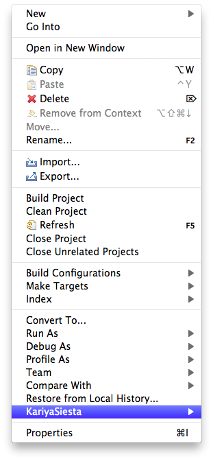
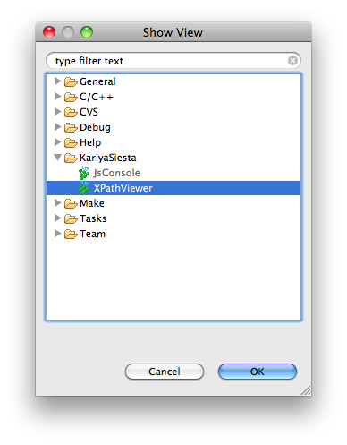
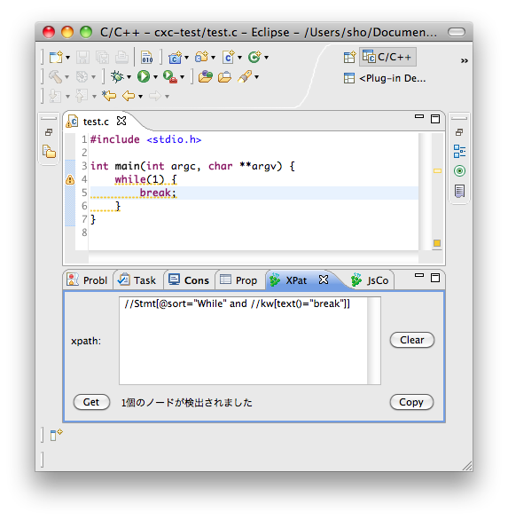

チュートリアル
=======================

SDB の作成
-----------------------
SDB はソフトウェアデータベースの略で、C言語ソースコードの解析結果を保存しています。
KariyaSiesta はソースコードのチェックに SDB を利用しているため、
チェックの前に SDB を構築する必要があります。

**Project Explorer** からチェックしたいプロジェクトを右クリックし、
**KariyaSiesta** -> **Create SDB** をクリックします。

.. image:: _static/tutorial_sdb2.png

これで SDB の構築は終了です。

XPathViwer の使い方
-----------------------

**Window** -> **Show View** -> **Other...** をクリックし、
**KariyaSiesta** 内の **XPath Viewer** をクリックします。 **OK** をクリッ
クします。

表示された XPathViwer 内のテキストエリアに XPath 式を入力して TAB キーを押すと、
XPath 式で指定された部分にマーカが表示されます。

XPathViwer 内のボタンの機能は以下の通りです。

**Clear:**
  テキストエリアに入力した XPath 式が削除されます。
**Get:**
  エディタでソースコードの一部を選択し Get ボタンを押すと、
  その部分の XPath 式がテキストエリアに出力されます。
**Copy:**
  入力した XPath 式に対応するルール設定ファイルがクリップボードにコピーされます。

XPath によるルールの作成方法
-----------------------------
CX-Model については `ドキュメント <#>`_ を参照してください。

while ブロック内部で break を使ってはいけないというルールは ::

  //Stmt[@sort="While" and .//keyword[text()="break"]]

ルールの設定方法
-----------------------
ルール設定ファイルの書式、設定方法(プロジェクトのプロパティとか)

チェック方法
-----------------------
